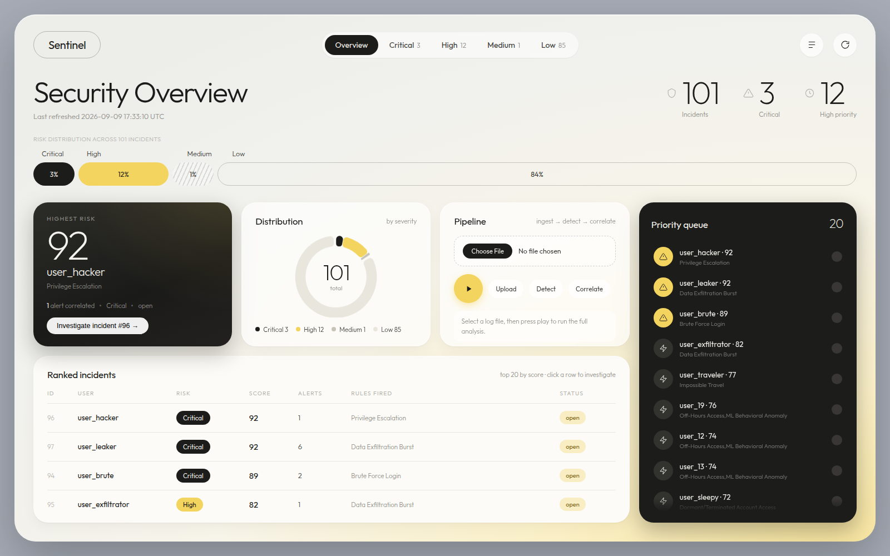

# Security Log Analyzer

A hybrid security-incident detection engine. It ingests raw access logs, runs a
deterministic rule engine **and** a per-user machine-learning anomaly detector
over them, correlates the resulting alerts into scored incidents, and hands an
analyst a ranked queue where **every incident carries the human-readable
evidence that produced it** — plus a remediation checklist and an exportable
report.



---

## What it actually does

Feed it a log file; get back prioritised incidents. The pipeline has five stages:

**1 · Ingest** — `POST /api/logs/upload` accepts CSV, JSON, JSONL/NDJSON or
syslog. Field names are normalised through an alias map, so `user`, `username`,
`user_id`, `actor` and `principal` all land in the same column. Timestamps are
coerced to UTC; rows with no IP or an unparseable timestamp are counted and
skipped rather than failing the batch.

**2 · Detect** — `GET /api/alerts` runs two detectors side by side:

- **Seven deterministic rules** over a time-indexed DataFrame (see table below).
  Each alert carries an evidence string naming exact counts, times and IPs.
- **A per-user IsolationForest.** Every user's activity is bucketed into 1-hour
  windows, nine behavioural features are extracted per window, and *one model is
  fitted per user on that user's own history*. So a user who always logs in at
  3 AM is never flagged for it — but a 9-to-5 user who suddenly does, is. Scores
  are normalised to 0–1 per user; ≥ 0.60 emits an alert.

**3 · Correlate** — `GET /api/incidents` collapses alerts into incidents by
`(user, 30-minute bucket)` and scores each one. This is what stops alert
fatigue: 119 alerts become 101 incidents, and the three that matter sort to the
top.

**4 · Remediate** — every fired rule maps to a concrete action with a priority
(`IMMEDIATE` → `LOW`), attached to the incident automatically.

**5 · Report** — Markdown or a styled PDF, per incident or org-wide. Status
changes (`open → reviewing → resolved / false_positive`) are written to an
immutable audit log in the same transaction.

### Worked example

Six failed logins for `user_brute` from `10.0.0.99`, one minute apart:

```
2026-09-03T19:48:33,user_brute,login,/api/login,10.0.0.99,failed
... ×6
```

The rolling window hits 5 at the fifth failure and 6 at the sixth, so
`brute_force_001` fires **twice**, each worth 85 points, each with evidence:

> `User user_brute at IP 10.0.0.99 had 6 failed logins within 10 minutes (triggered at 2026-09-03 19:53:33).`

Both alerts fall in one 30-minute bucket, so they correlate into a single
incident scored `85 + min(2×2, 20) = 89` → **Critical**, with the action *"Force
password reset and enable MFA for this account"* at priority `IMMEDIATE`.

---

## Detection rules

| Rule ID | Detects | Criteria | Points | Severity |
|---|---|---|---|---|
| `priv_esc_001` | Privilege escalation | A `privilege_escalation` or `role_elevation` event | 90 | High |
| `brute_force_001` | Brute-force login | ≥ 5 failed logins, same user + IP, 10-min rolling window | 85 | High |
| `exfil_burst_001` | Data exfiltration | ≥ 100 exports in 5 min, **or** an export immediately after a blocked action | 80 | High |
| `impossible_travel_001` | Impossible travel | Access from ≥ 2 countries within 10 min (IP-prefix geolocation) | 75 | High |
| `dormant_account_001` | Dormant account reuse | A login after > 30 days of inactivity | 70 | High |
| `recon_001` | Recon / access spray | ≥ 10 blocked attempts by one user in 30 min | 60 | Medium |
| `off_hours_001` | Off-hours access | A login between 23:00 and 06:00 | 40 | Medium |
| `ml_anomaly_001` | Behavioural anomaly | IsolationForest score ≥ 0.60 vs. that user's own baseline | score × 100 | High ≥ 0.85, else Medium |

### Risk scoring

```
score = max(rule points)  +  min(alert_count × 2, 20)  +  (max ML score × 30)
```

| Score | Risk |
|---|---|
| ≥ 85 | Critical |
| 65 – 84 | High |
| 45 – 64 | Medium |
| < 45 | Low |

---

## Tech stack

| Layer | Choice | Why |
|---|---|---|
| API | **FastAPI** + Uvicorn | Async, auto-generated OpenAPI docs at `/docs` |
| Data | **pandas** | Rolling time-window operations are what the rule engine is built on |
| ML | **scikit-learn** (IsolationForest) | Unsupervised — no labelled attack data needed |
| Storage | **SQLAlchemy 2** → SQLite *or* Postgres | One `DATABASE_URL` switches backends |
| UI | **Jinja2** + vanilla JS + Chart.js | Server-rendered; no build step, no framework |
| Reports | **ReportLab** (PDF), **Markdown** | PDF for stakeholders, Markdown for tickets |
| Log mining | **Drain3** | Collapses thousands of log lines into a few templates |
| AI narrative | **Google Gemini** (`google-genai`) | Optional plain-English exec summary |
| Deploy | **Render** blueprint / **Docker** | See [DEPLOY.md](DEPLOY.md) |

Everything except the AI narrative runs **fully offline** — no data leaves the
host. The narrative is the one feature that calls an external API, and it is
opt-in via an API key.

---

## Quick start

```bash
git clone https://github.com/Anshika-17a/Security-Log-Analyzer.git
cd Security-Log-Analyzer

python3 -m venv venv
source venv/bin/activate          # Windows: venv\Scripts\activate

pip install -r requirements.txt   # everything needed, nothing extra

cp .env.example .env              # optional — see Configuration
python -m uvicorn app.main:app --reload
```

Open **http://localhost:8000**. Pick `data/sample_logs.csv` in the Pipeline
card, press ▶, and the dashboard reloads with 101 incidents.

Prefer the terminal? `bash tests/demo_script.sh` drives the whole pipeline.

> **Python 3.11 – 3.14** are supported. The pinned dependency set is verified on
> 3.14 and every pin publishes 3.13 wheels for the deploy target.

---

## Configuration

All settings are environment variables, read from `.env` locally (via
`python-dotenv`) or from your host's dashboard in production.

| Variable | Default | Purpose |
|---|---|---|
| `DATABASE_URL` | `sqlite:///./logs.db` | SQLite or Postgres. `postgres://` and `postgresql://` URLs are rewritten to psycopg v3 automatically, so provider connection strings work verbatim. |
| `GEMINI_API_KEY` | *(unset)* | Enables the AI narrative. See below. |
| `SEED_ON_START` | `false` | Populate an empty database from `SEED_FILE` on boot and run the pipeline. No-ops if logs already exist. |
| `SEED_FILE` | `data/sample_logs.csv` | Which file to seed from. |
| `PORT` | `8000` | Injected by the host in production. |

### Where the Gemini API key goes

The key powers the **Generate narrative** button in the incident modal, which
clusters that incident's logs with Drain3 and asks Gemini for a two-paragraph
executive summary.

Get a free key at **https://aistudio.google.com/apikey**, then:

**Locally** — put it in `.env` (already gitignored):

```bash
cp .env.example .env
```
```ini
GEMINI_API_KEY=AIza...your_key_here
```

Restart the server. `load_dotenv()` picks it up at import time, so a running
server will not see a newly added key.

**In production** — set it as an environment variable in your host's dashboard,
never in a file. On Render: *Service → Environment → Add Environment Variable*,
key `GEMINI_API_KEY`. `render.yaml` deliberately leaves it out so a real key is
never committed.

Without a key nothing breaks — the endpoint returns an explanatory message and
the rest of the app is unaffected.

> **Never commit the key.** `.env` and `*.env` are gitignored. If you ever paste
> one into a tracked file, revoke it in AI Studio immediately — rotating is far
> easier than scrubbing git history.

---

## API

| Method | Endpoint | Purpose |
|---|---|---|
| `GET` | `/` | Dashboard UI |
| `GET` | `/health` | Health check |
| `GET` | `/docs` | Swagger UI |
| `POST` | `/api/logs/upload` | Ingest a CSV / JSON / JSONL / syslog file |
| `GET` | `/api/alerts` | Run the rule engine + ML detector |
| `GET` | `/api/incidents` | Correlate alerts into scored incidents |
| `GET` | `/api/incidents/{id}` | Full incident detail: evidence, rules, actions |
| `PUT` | `/api/incidents/{id}/status` | Update status; writes an audit-log row |
| `GET` | `/api/incidents/{id}/narrative` | Drain3 clustering + Gemini summary |
| `GET` | `/api/reports/{id}?format=md\|pdf` | Per-incident report |
| `GET` | `/api/reports/summary?format=md\|pdf` | Org-wide report across open incidents |

`/api/alerts` **appends** on every call, while `/api/incidents` rebuilds
incidents from scratch each time. Delete `logs.db` (or truncate the tables) to
reset.

---

## Project structure

```
app/
  main.py                     FastAPI routes, startup seeding
  ingestion/parser.py         Multi-format parsing + field normalisation
  detection/
    rules.py                  The 7 deterministic rules
    baseline.py               Per-entity rolling baselines (dialect-aware upsert)
    ml_anomaly.py             Per-user IsolationForest, 9 features/hour-window
  correlation/
    grouping.py               Alerts -> incidents, 30-min buckets
    scoring.py                Composite risk score + tier mapping
  remediation/recommendations.py   Rule -> action mapping
  reporting/
    report_generator.py       Markdown + ReportLab PDF
    narrative.py              Drain3 clustering + Gemini
  models/                     SQLAlchemy schema, engine, Pydantic models
  dashboard/templates/        Jinja2 dashboard
data/
  sample_logs.csv             500 rows with 7 attacks seeded
  sample_10k.csv              10k rows for load testing
  gen_synthetic_logs.py       Regenerate with --rows N
tests/demo_script.sh          End-to-end pipeline demo
```

---

## Deployment

See **[DEPLOY.md](DEPLOY.md)** for step-by-step instructions. Short version:
push to GitHub, then *Render → New → Blueprint → select this repo*.
[`render.yaml`](render.yaml) provisions Postgres, wires `DATABASE_URL`, and
seeds the database on first boot.

---

## Known limitations

Worth stating plainly rather than discovering during a demo:

- **No authentication.** CORS is `allow_origins=["*"]` and every endpoint is
  open. Fine for a demo with synthetic data; not for real logs.
- **Geolocation is a prefix map,** not a real GeoIP database — impossible-travel
  detection only recognises the IP ranges in `rules.py`.
- **Correlation uses fixed 30-minute buckets,** not a sliding window, so an
  attack straddling a boundary splits into two incidents.
- **The ML detector is order-blind.** It aggregates each hour into counts, so
  `login → export → privesc` and `privesc → login → export` score identically.
  A sequence model would close this gap.
- **The scoring formula has a fourth term** (`deviation_from_user_baseline`)
  that the ML detector never emits, so it always contributes 0.
- **`ARCHITECTURE_AND_WORKFLOW.md` predates the current code** in places —
  this README reflects what actually runs.
